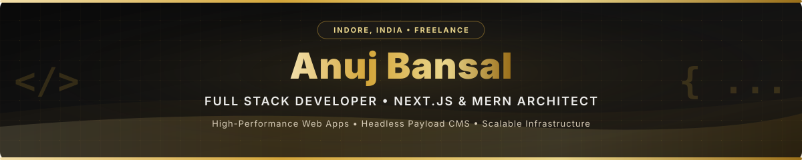
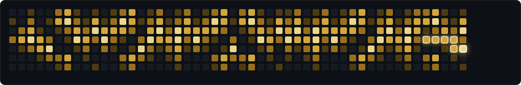

  
  

---

### 👋 About Me & Engineering Philosophy

I am a **Freelance Web Developer** and **Full Stack Developer** based in **Indore, Madhya Pradesh**, **India**, working with clients across India and internationally. As a specialized **Next.js Developer**, **MERN Stack Developer**, and **Payload CMS Developer**, I engineer high-performance web applications, custom internal tools, and modern headless CMS platforms focused on speed, clean architecture, and conversion.

My focus is on building software that scales effortlessly — combining modern **Next.js 15 & React 19** frontends with robust **Node.js, Express, and MongoDB** server architectures, sub-second API performance, and hardened Linux server infrastructure.

---

### 📊 Engineering Impact & Metrics

| Key Metric | Engineering Achievement & Scope | Primary Tech Stack |
| :--- | :--- | :--- |
| **270+ Client Apps** | Architected & deployed a centralized financial calculation engine powering 270+ production client applications | `Node.js` `Express` `MongoDB` `Redis` |
| **150+ Portals Hardened** | Consolidated distributed client portals into a unified Next.js monorepo with 48-hr vulnerability response | `Next.js` `TypeScript` `Linux` `PM2` |
| **< 40ms Average Latency** | Optimized database indexing & Redis caching for multi-tenant microservices under heavy traffic | `Redis` `MongoDB` `Node.js` |
| **100/100 Core Web Vitals** | Engineered client websites for instant page loads, SSR performance, and complete On-Page SEO | `Next.js 15` `Tailwind CSS` `Vercel` |

  

### 🛠️ Core Capabilities & Services

- 🚀 **Full Stack SaaS & Web Applications**: Custom Next.js 15 & MERN stack applications with role-based authentication, real-time data sync, and dynamic databases.
- ⚡ **Custom Web Development & On-Page SEO**: Fast, server-rendered Next.js web applications optimized for 100/100 Core Web Vitals, JSON-LD Schema, and search engine rankings.
- 📦 **Headless Payload CMS Engineering**: Native Payload CMS v3 implementations integrated with Next.js, empowering non-technical teams with self-hosted admin panels.
- 📊 **Interactive Dashboards & Internal Tooling**: Bespoke admin interfaces, analytical dashboards, and workflow automation tools tailored for team productivity.
- 🛡️ **DevOps & Linux Server Hardening**: Linux server administration (Ubuntu/Debian), Nginx reverse proxy configuration, PM2 fleet management, and security audits.

---

### 🧰 Technical Stack

#### 💻 Frontend Engineering

  
  
  
  
  
  

#### ⚙️ Backend & Microservices

  
  
  
  
  
  

#### 🗄️ Database & CMS Architecture

  
  
  
  

#### 🔧 Infrastructure & DevOps

  
  
  
  
  
  

  

### 🚀 Featured Systems & Case Studies

| Project | Tech Stack | Architectural Solution & Impact | Case Study |
| :--- | :--- | :--- | :--- |
| **[Central Calculator Engine](https://anujbansaldev.in/work/central-calculator-engine)** | `Node.js` `MongoDB` `Next.js` `Express` `Redis` | Centralized financial calculation logic engine powering 270+ client production apps. Eliminated duplicated repositories and maintained sub-40ms latency. | [Read Case Study](https://anujbansaldev.in/work/central-calculator-engine) |
| **[Internal Workflow App](https://anujbansaldev.in/work/internal-workflow-app)** | `React` `Node.js` `MongoDB` `JWT` `RBAC` | Custom task coordination application for Redvision, streamlining client-PM-developer handoffs and replacing fragmented email chains across 3 production teams. | [Read Case Study](https://anujbansaldev.in/work/internal-workflow-app) |
| **[Monorepo & Hardening](https://anujbansaldev.in/work/monorepo-security-hardening)** | `Next.js` `TypeScript` `Linux` `Bash` `Nginx` | Consolidated 150+ distributed client portals into a unified Next.js monorepo architecture. Co-resolved live server vulnerabilities within 48 hours. | [Read Case Study](https://anujbansaldev.in/work/monorepo-security-hardening) |
| **[Real-Time Chat Engine](https://anujbansaldev.in/work/real-time-chat-application)** | `Socket.io` `Node.js` `MongoDB` `React` | High-throughput instant messaging engine featuring live user presence, typing states, and decoupled WebSocket database queues. | [Read Case Study](https://anujbansaldev.in/work/real-time-chat-application) |
| **[RBAC Auth Module](https://anujbansaldev.in/work/rbac-auth-system)** | `JWT` `Express.js` `MongoDB` `Node.js` | Reusable multi-role authentication module supporting granular permission arrays, route middleware, and HTTP-only cookie security. | [Read Case Study](https://anujbansaldev.in/work/rbac-auth-system) |

---

### 🏆 GitHub Achievements & Milestones

  
  
  
  
  

  

---

### 🐍 Contribution Activity

  <picture>
    <source media="(prefers-color-scheme: dark)" srcset="./assets/github-contribution-grid-snake-dark.svg">
    <source media="(prefers-color-scheme: light)" srcset="./assets/github-contribution-grid-snake-dark.svg">
    
  </picture>

  

### 🌐 Connect & Collaborate

  
  
  
  
  
  
  

---

### 📝 Latest Technical Publications

<!-- BLOG-POST-LIST:START -->
<!-- Recent blog posts will be automatically populated here by GitHub Actions -->
<!-- BLOG-POST-LIST:END -->

---

  

    

  Crafted with precision, clean code, and care — let's build something exceptional together.

